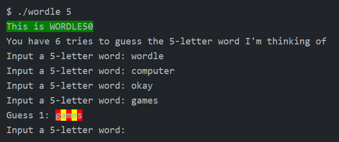

# c_43_wordle50

## DESCRIPTION

Implement a program that behaves similarly to the popular Wordle daily word game.


### BACKGROUND

Odds are, if you’re a Facebook user, at least one of your friends posted something looking like this, particularly back in early 2022 when it was all the rage:


If so, your friend has played Wordle, and are sharing their results for that day! Each day, a new “secret word” is chosen (the same for everyone) and the object is to guess what the secret word is within six tries. Fortunately, given that there are more than six five-letter words in the English language, you may get some clues along the way, and the image above actually shows your friend’s progression through their guesses, using those clues to try to home in on the correct word. Using a scheme similar to the game Mastermind, if after you guess that letter turns green, it means not only is that letter in the secret word that day, but it is also in the correct position. If it turns yellow, it means that the letter guessed appears somewhere in the word, but not in that spot. Letters that turn gray aren’t in the word at all and can be omitted from future guesses.

Let’s finish writing a program called wordle that enables us to recreate this game and play it in our terminal instead. We’ll make a few slight changes to the game (for example, the way it handles a letter appearing twice in a word isn’t the same as how the real game handles it, but for simplicity’s sake, we’ll err on the side of ease of understanding rather than a perfectly faithful interpretation), and we’ll use red text instead of gray to indicate letters that aren’t in the word at all. At the time the user executes the program, they should decide, by providing a command-line argument, what the length of the word they want to guess is, between 5 and 8 letters.

Here are a few examples of how the program should work. For example, if the user omits a command line argument entirely:

```bash
./wordle
Usage: ./wordle wordsize
```

If the user instead does provide a command-line argument, but it’s not in the correct range:

```bash
./wordle 4
Error: wordsize must be either 5, 6, 7, or 8
```

Here’s how the program might work if the user provides a key of 5:

```bash
./wordle 5
This is WORDLE50
You have 6 tries to guess the 5-letter word I'm thinking of
Input a 5-letter word:
```

At which point, the user should type in a 5-letter word. Of course, the user could well be stubborn, and we should make sure they’re following the rules:



Notice that we didn’t even count any of those invalid attempts as guesses. But as soon as they made a legitimate attempt, we counted it as a guess and reported on the status of the word. Looks like the user has a few clues now; they know the word contains an `a` and an `e` somewhere, but not in the exact spots they appear in the word games. And they know that `g`, `m`, and `s` don’t appear in the word at all, so future guesses can omit them. Perhaps they might try, say, `heart` next!

## SPECIFICATION

1. You should ensure the program accepts a single command-line argument. Let’s call it `k` for the sake of discussion. If the program was not run with a single command-line argument, you should `print` the error message as we demonstrate above and `return 1`, ending the program.

2. You should make sure that `k` is one of the acceptable values (5, 6, 7, or 8), and store that value in  `wordsize`; we’ll need to make use of that later. If the value of `k` is not one of those four values exactly, you should print the error message as we demonstrate above and `return 1`, ending the program.

3. Open the word list for the length of word the user wants to guess and randomly select one from the 1000 options available.

4. You should help defend against stubborn users by making sure their guess is the correct length. For that, implement a function named `get_guess`. A user should be prompted (as via `get_string`) to type in a `k`-letter word (remember, that value is passed in as a parameter to `get_guess`) and if they supply a guess of the wrong length, they should be re-prompted until they provide exactly the value you expect from them. Note that unlike the real Wordle, we actually don’t check that the user’s guess is a real word, so in that sense the game is perhaps a little bit easier.

5. All guesses in this game should be in lowercase characters, implement the `get_guess` function to change the user input to all lowercase letters. Once a legitimate guess has been obtained, it can be returned.

6. Next, we need to keep track of a user’s `“score”` in the game. We do this both on a per-letter basis—by assigning a score of `2` (which we `#define` as `EXACT`) to a letter in the correct place, `1` (which we `#define` as `CLOSE`) to a letter that’s in the word but in the wrong place, or `0` (which we `#define` as `WRONG`)—and a per-word basis, to help us detect when we’ve potentially triggered the end of the game by winning. We’ll use the individual letter scores when we color-code the printing. In order to store those scores, we need an array, which we’ve called `status`. At the start of the game, with no guesses having taken place, it should contain all 0s.

7. Inside of the `check_word` function, it’s up to you to compare each of the letters of the guess with each of the letters of the choice (which, recall, is the “secret word” for this game), and assign scores. If the letters match, award `EXACT` (2) points and break out of the loop—there’s no need to continue looping if you already determined the letter is in the right spot. If you find that the letter is in the word but not in the right spot, award `CLOSE` (1) points but don’t break! After all, that letter might later show up in the right spot in the choice word, and if we break too soon, the user would never know it! You don’t actually need to explicitly set `WRONG` (0) points here, since you handled that. Ultimately though, you should also be summing up the total score of the word when you know it, because that’s what this function is supposed to ultimately return.  

8. Complete the implementation of `print_word`. That function should look through the values you populated the status array with and print out, character by character, each letter of the guess with the correct color code.

9. Finally, tidying up before the program terminates. Whether the main `for` loop has ended normally, by the user running out of guesses, or because we broke out of it by getting the word exactly right, it’s time to report to the user on the game’s outcome. If the user did win the game, a simple `You won!` suffices to print here. Otherwise, you should print a message telling the user what the target word was, so they know the game was being honest with them.

## INSTALL LIBRARIES

The source code uses the cs50 library what you can download [HERE](https://github.com/cs50/libcs50).

To install the cs50 library follow the steps:

1. Open git bash terminal and change the current working directory to `src`:  
   > cd ./libsc50/src

2. Compile the cs50.c source into .o with:
   > gcc -c cs50.c -o cs50.o

3. Make the library archive:  
   > ar rcs libcs50.a cs50.o

4. Copy the `libcs50.a` file into your compiler's `lib` directory

5. Copy the `cs50.h` file into your compiler's `include` directory

## COMPILE AND RUN THE CODE

The code is written in C, the compiler used to generate the exe is: `gcc Rev10, Built by MSYS2 project 12.2.0`

Run the below code in terminal (git bash) to compile the source:

> gcc commandLineArgument.c -lcs50 -o ./build/commandLineArgument

To run the executable run the below code in terminal (git bash):

> ./build/commandLineArgument.exe
